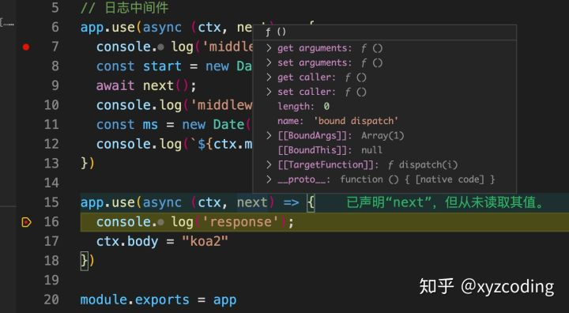
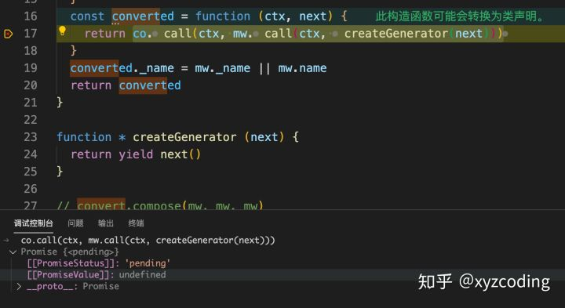

# Koa2第一篇：详解生成器

## 什么是Koa2?


## koa-generator

Koa2提供了一个生成器koa-generator，用于Koa2开发者生成一个项目骨架，方便开发者开箱即用。

生成器主要功能包括：

- 约定目录结构
- 集成一些基础的、必要的中间件
- app.js作为入口文件
- bin/www作为启动入口
- 支持静态服务器
- 支持routes路由目录
- 支持views视图目录，默认pug作为模板引擎


### package.json

```js
{
  "name": "koa-demo",
  "version": "0.1.0",
  "private": true,
  "scripts": {
    "start": "node bin/www", // 代码变动需要重启node进程
    "dev": "./node_modules/.bin/nodemon bin/www", // 代码变动，通过nodemon自动重启node进程
    "prd": "pm2 start bin/www",// 生产环境 pm2启动
    "test": "echo \"Error: no test specified\" && exit 1"
  },
  "dependencies": {
    "debug": "^4.1.1", // 根据Debug环境变量输出调试日志
    "koa": "^2.7.0", 
    "koa-bodyparser": "^4.2.1",// 解析body，主要针对post请求
    "koa-convert": "^1.2.0", // 兼容Koa2中间件写法
    "koa-json": "^2.0.2", // 对json更好对的支持
    "koa-logger": "^3.2.0", // 开发阶段的日志模块
    "koa-onerror": "^4.1.0", // 错误处理模块
    "koa-router": "^7.4.0", // 路由
    "koa-static": "^5.0.0", // HTTP静态服务器
    "koa-views": "^6.2.0", // 视图渲染
    "pug": "^2.0.3" // 模板引擎
  },
  "devDependencies": {
    "nodemon": "^1.19.1" // 自动重启node进程
  }
}
```

### bin/www

bin/www是应用的启动入口。

```powershell
#!/usr/bin/env node

/**
 * Module dependencies.启动文件
 */

var app = require('../app');
var debug = require('debug')('demo:server');
var http = require('http');

/**
 * Get port from environment and store in Express.
 */

var port = normalizePort(process.env.PORT || '3000');
// app.set('port', port);

/**
 * Create HTTP server.
 * http://nodejs.cn/api/http.html#http_class_http_server
 * 返回的是一个http.Server实例，继承自: <net.Server>
 * http://nodejs.cn/api/net.html#net_class_net_server
 * 而<net.Server>继承自: <EventEmitter>
 * http://nodejs.cn/api/events.html#events_class_eventemitter
 */
var server = http.createServer(app.callback());

/**
 * Listen on provided port, on all network interfaces.
 */

// 启动 HTTP 服务器用于监听连接
server.listen(port);
// on方法来自于<EventEmitter>
// error、listening事件来自于<net.Server>
server.on('error', onError);
server.on('listening', onListening);

/**
 * Normalize a port into a number, string, or false.
 */

function normalizePort(val) {
  var port = parseInt(val, 10);

  if (isNaN(port)) {
    // named pipe
    return val;
  }

  if (port >= 0) {
    // port number
    return port;
  }

  return false;
}

/**
 * Event listener for HTTP server "error" event.
 */

function onError(error) {
  // 关于失败的系统调用描述：http://nodejs.cn/api/errors.html#errors_error_syscall
  // https://man7.org/linux/man-pages/man2/syscalls.2.html
  if (error.syscall !== 'listen') {
    throw error;
  }

  var bind = typeof port === 'string'
    ? 'Pipe ' + port
    : 'Port ' + port;

  // handle specific listen errors with friendly messages
  switch (error.code) {
    case 'EACCES':
      // 拒绝访问)
      console.error(bind + ' requires elevated privileges');
      // http://nodejs.cn/api/process.html#process_process_exit_code
      // 调用 process.exit() 将强制进程尽快退出，即使还有尚未完全完成的异步操作，包括对 process.stdout 和 process.stderr 的 I/O 操作。
      process.exit(1);
      break;
    case 'EADDRINUSE':
      // 地址已经被使用
      console.error(bind + ' is already in use');
      process.exit(1);
      break;
    default:
      throw error;
  }
}

/**
 * Event listener for HTTP server "listening" event.
 */

function onListening() {
  // http://nodejs.cn/api/net.html#net_server_address
  var addr = server.address();
  var bind = typeof addr === 'string'
    ? 'pipe ' + addr
    : 'port ' + addr.port;
  debug('Listening on ' + bind);
}
```

### app.js

```js
const Koa = require('koa')
const app = new Koa()
const views = require('koa-views')
const json = require('koa-json')
const onerror = require('koa-onerror')
const bodyparser = require('koa-bodyparser')
const logger = require('koa-logger')

const index = require('./routes/index')
const users = require('./routes/users')

// 错误处理
onerror(app)

// 挂载中间件
app.use(bodyparser({
  enableTypes:['json', 'form', 'text']
}))
app.use(json())
app.use(logger())
app.use(require('koa-static')(__dirname + '/public'))

app.use(views(__dirname + '/views', {
  extension: 'pug'
}))

// 日志中间件
app.use(async (ctx, next) => {
  const start = new Date()
  await next()
  const ms = new Date() - start
  console.log(`${ctx.method} ${ctx.url} - ${ms}ms`)
})

// 路由
app.use(index.routes(), index.allowedMethods())
app.use(users.routes(), users.allowedMethods())

// error-handling
app.on('error', (err, ctx) => {
  console.error('server error', err, ctx)
});

module.exports = app
```

Koa2推荐的中间件写法是：

```js
app.use(async(ctx, next) => {
   // ...
})
```

### 路由

路由本身也是一种中间件，不过我们由于职责拆分，将其独立到routes目录下。

```js
const router = require('koa-router')()

// 视图渲染
router.get('/', async (ctx, next) => {
  await ctx.render('index', {
    title: 'Hello Koa 2!'
  })
})

// ctx.body是一个字符串
router.get('/string', async (ctx, next) => {
  ctx.body = 'koa2 string'
})

// ctx.body是一个json
router.get('/json', async (ctx, next) => {
  ctx.body = {
    title: 'koa2 json'
  }
})

module.exports = router
```

ctx.render方法不是Koa2自身的，而是koa-views中间件绑定到ctx上下文的。可见很多时候，我们可以通过中间件在ctx挂载一些业务方法，比如统一处理接口响应的json约定格式方法。

### 静态服务器

```text
// app.js

app.use(require('koa-static')(__dirname + '/public'))
```

静态服务器主要存放一些静态资源，这里是通过koa-static中间件实现，它是基于koa-send模块的封装。


koa-static推荐与koa-router结合使用，这样就不需要每个请求都经过koa-static。

```text
// koa-router支持多个中间件
router.get('/public', async(ctx,netx) => {
}, staticServer(resolve('./public)))
```

### 视图

关于模板引擎的配置

```js
app.use(views(__dirname + '/views', {
  extension: 'pug'
}))
```

单纯的html不够强大，不能提供很好的复用。而模板引擎就是基于复用思想的一种定义模板的语法，使用时候它把数据与模板一起编译，生成html。

```js
// 视图渲染
router.get('/', async (ctx, next) => {  
  // ctx.render方法第一个参数是模板相对路径，相对于views目录下 
  // 第二个参数就是传入到模板的数据
  await ctx.render('index', {
    title: 'Hello Koa 2!'
  })
})
```

模板引擎工作原理：

- ctx.render()方法指定需要渲染的模板路径
- 根据路径读取该文件模板
- 通过模板引擎编译器把数据与模板内容一起编译为HTML字符串
- 将响应头的Content-Type设置text/html; charset=utf-8
- 通过http模块底层的res.write以及res.end方法把html字符串写到浏览器


# Koa2第二篇：中间件

Koa2本身只能算一个极简的HTTP服务器，自身不内置中间件，但是提供中间件内核。中间件是Koa2的核心，因此需要熟练掌握。

### 中间件是什么？

你可以把一个HTTP请求理解为水流，而各种各样的中间件类似各种管道，它会对水流进行处理。每个中间件在HTTP请求过程中会改写请求，响应等数据。


也就是我们常说的洋葱模型。


我们可以通过一个实例理解上述的过程：

```js
const Koa = require('koa')
const app = new Koa()


// 日志中间件
app.use(async (ctx, next) => {
  console.log('middleware before await');
  const start = new Date()
  await next() // 函数控制权转移
  console.log('middleware after await');
  const ms = new Date() - start
  console.log(`${ctx.method} ${ctx.url} - ${ms}ms`)
})

app.use(async(ctx, next) => {
  console.log('response');
  ctx.body = "hello koa2"
})

module.exports = app
```

终端：

```text
middleware before await
response
middleware after await
```

### 中间件写法

### 通用函数中间件

```js
// 日志中间件
app.use((ctx, next) => {
  console.log('middleware before await');
  const start = new Date()
  return next().then(() => {
    console.log('middleware after await');
    const ms = new Date() - start
    console.log(`${ctx.method} ${ctx.url} - ${ms}ms`)
  })
})
```

上述写法不够简洁。

### 生成器函数中间件

```js
const convert = require('koa-convert');

// 日志中间件
app.use(function* log(next) {
  console.log('middleware before await');
  const start = new Date()
  yield next
  const ms = new Date() - start
  console.log(`${this.method} ${this.url} - ${ms}ms`)
})
```

**这里有个小细节，因为我们这里中间件没有使用箭头函数，因此其实这里的this就是我们平时说的上下文对象ctx。这也说明了使用async箭头函数式中间件时候，为什么Koa2需要显示提供ctx对象, 就是为了解决此处用this引用会有问题。**

### **async函数中间件**

```js
app.use(async ctx => {
  ctx.body = 'Hello World';
});
```

### 上下文对象

在Koa2中，ctx是一次完整的HTTP请求的上下文，会贯穿这个请求的生命周期。也就是说在整个请求阶段都是共享的。

```js
  createContext(req, res) {
    const context = Object.create(this.context);
    // request、response是Koa2内置的对象
    // 业务中我们一般通过ctx.request、ctx.response访问
    const request = context.request = Object.create(this.request);
    const response = context.response = Object.create(this.response);
    // 挂在app自身
    context.app = request.app = response.app = this;
    // 挂在node原生的内置对象
    // req: http://nodejs.cn/api/http.html#http_class_http_incomingmessage
    // res: http://nodejs.cn/api/http.html#http_class_http_serverresponse
    context.req = request.req = response.req = req;
    context.res = request.res = response.res = res;
    request.ctx = response.ctx = context;
    request.response = response;
    response.request = request;
    // 最初的URL
    context.originalUrl = request.originalUrl = req.url;
    // 一个中间件生命周期内公共的存储空间
    context.state = {};
    return context;
  }
```

### ctx.body

ctx.body主要是Koa2返回数据到客户端的方法。

```text
// context.js
/**
 * Response delegation.
 */

delegate(proto, 'response')
  .access('body')
```

可见ctx.body实际上是对在response.js的body进行赋值操作。

ctx.body的一些特性：

- 可以直接返回一个文本
- 可以返回一个HTML文本
- 可以返回JSON

```text
ctx.body = 'hello'

ctx.body = '<h2>h2</h2>'

ctx.body = {
  name: 'kobe'
}
```


```js
  get status() {
    return this.res.statusCode;
  },

  /**
   * Set response status code.
   *
   * @param {Number} code
   * @api public
   */

  set status(code) {
    if (this.headerSent) return;

    assert(Number.isInteger(code), 'status code must be a number');
    assert(code >= 100 && code <= 999, `invalid status code: ${code}`);
    this._explicitStatus = true;
    this.res.statusCode = code;
    // 客户端发送的 HTTP 版本，message.httpVersionMajor 是第一个整数， message.httpVersionMinor 是第二个整数。
    // http://nodejs.cn/api/http.html#http_message_httpversion
    // 设置状态消息 http://nodejs.cn/api/http.html#http_response_statusmessage
    if (this.req.httpVersionMajor < 2) this.res.statusMessage = statuses[code];
    if (this.body && statuses.empty[code]) this.body = null;
  }, 

/**
   * Set response body.
   *
   * @param {String|Buffer|Object|Stream} val
   * @api public
   */

  set body(val) {
    // this._body是真正的body属性或者说代理属性
    const original = this._body;
    this._body = val;

    // no content
    if (null == val) {
      // 204 "no content"
      if (!statuses.empty[this.status]) this.status = 204;
      if (val === null) this._explicitNullBody = true;
      this.remove('Content-Type');
      this.remove('Content-Length');
      this.remove('Transfer-Encoding');
      return;
    }

    // 设置状态码
    if (!this._explicitStatus) this.status = 200;

    // 设置content-type
    const setType = !this.has('Content-Type');

    // string
    if ('string' === typeof val) {
      // text/html or text/plain
      if (setType) this.type = /^\s*</.test(val) ? 'html' : 'text';
      this.length = Buffer.byteLength(val);
      return;
    }

    // buffer
    if (Buffer.isBuffer(val)) {
      if (setType) this.type = 'bin';
      this.length = val.length;
      return;
    }

    // stream
    if (val instanceof Stream) {
      onFinish(this.res, destroy.bind(null, val));
      if (original != val) {
        val.once('error', err => this.ctx.onerror(err));
        // overwriting
        if (null != original) this.remove('Content-Length');
      }

      if (setType) this.type = 'bin';
      return;
    }

    // json
    this.remove('Content-Length');
    this.type = 'json';
  },
```

ctx.body的工作原理就是根据其赋值的类型，来对Content-Type头进行处理，最后根据Content-Type类型值通过res.end，把数据写入到浏览器。

### ctx.redirect

浏览器重定向一般是向前或者向后重定向。

```js
  redirect(url, alt) {
    // location
    if ('back' === url) url = this.ctx.get('Referrer') || alt || '/';
    this.set('Location', encodeUrl(url));

    // status
    if (!statuses.redirect[this.status]) this.status = 302;

    // html
    if (this.ctx.accepts('html')) {
      url = escape(url);
      this.type = 'text/html; charset=utf-8';
      this.body = `Redirecting to <a href="${url}">${url}</a>.`;
      return;
    }

    // text
    this.type = 'text/plain; charset=utf-8';
    this.body = `Redirecting to ${url}.`;
  },
```

# Koa2第三篇：koa-compose

### Koa2中koa-compose的使用

```js
  /**
   * 添加中间件的方法
   * Use the given middleware `fn`.
   *
   * Old-style middleware will be converted.
   *
   * @param {Function} fn
   * @return {Application} self
   * @api public
   */

  use(fn) {
    // fn必须是函数
    if (typeof fn !== 'function') throw new TypeError('middleware must be a function!');
    // 兼容生成器函数的中间件写法
    if (isGeneratorFunction(fn)) {
      deprecate('Support for generators will be removed in v3. ' +
                'See the documentation for examples of how to convert old middleware ' +
                'https://github.com/koajs/koa/blob/master/docs/migration.md');
      fn = convert(fn);
    }
    debug('use %s', fn._name || fn.name || '-');
    // 添加中间件, 所有中间件是通过数组保存的
    this.middleware.push(fn);
    // 支持链式调用
    return this;
  }

  /**
   * Return a request handler callback
   * for node's native http server.
   *
   * @return {Function}
   * @api public
   */

  callback() {
    // 传入的是一个数组
    const fn = compose(this.middleware);
    // http://nodejs.cn/api/events.html#events_emitter_listenercount_eventname
    // 添加默认的错误异常处理
    if (!this.listenerCount('error')) this.on('error', this.onerror);

    const handleRequest = (req, res) => {
      // 创建每一次请求的下文文对象
      const ctx = this.createContext(req, res);
      // this.handleRequest处理每一次的请求流程
      // 熟悉的朋友可能就想到我们添加一个中间件的写法 app.use(async(ctx, next){ ... })
      return this.handleRequest(ctx, fn);
    };
    // 返回http.createServer()的参数requestListener
    return handleRequest;
  }

  /**
   * Handle request in callback.
   * 处理HTTP的请求回调
   * @api private
   */

  handleRequest(ctx, fnMiddleware) {
   // 每个请求会经过这个方法，后面调试可以看到
    const res = ctx.res;
    // http://nodejs.cn/api/http.html#http_response_statuscode
    res.statusCode = 404;
    const onerror = err => ctx.onerror(err);
    const handleResponse = () => respond(ctx);
    onFinished(res, onerror);
    return fnMiddleware(ctx).then(handleResponse).catch(onerror);
  }
```

### koa-compose

接下来我们通过断点调试的方式来熟悉中间件的来龙去脉。

```js
const Koa = require('koa')
const app = new Koa()
const convert = require('koa-convert');

// 日志中间件
app.use(async(ctx, next) => {
  console.log('middleware before await');
  const start = new Date()
  await next();
  console.log('middleware after await');
  const ms = new Date() - start
  console.log(`${ctx.method} ${ctx.url} - ${ms}ms`)
})

app.use(async(ctx, next) => {
  console.log('response');
  ctx.body = ""
})

module.exports = app
```

通过debug模式启动

```js
// bin/www
var server = http.createServer(app.callback());
```

进入koa-compose源码断点的位置是从

```js
 // application.js  
 callback() {
    // 进入koa-compose 
    const fn = compose(this.middleware); 

    if (!this.listenerCount('error')) this.on('error', this.onerror);

    const handleRequest = (req, res) => {
      const ctx = this.createContext(req, res);
      return this.handleRequest(ctx, fn);
    };

    return handleRequest;
  }
```


执行完一遍koa-compose后，会返回一个包装函数。

然后在浏览器端访问[http://localhost:3000/1212](https://link.zhihu.com/?target=http%3A//localhost%3A3000/1212)

此时一个请求进来会经过application.js中的handleRequest方法。


```js
  handleRequest(ctx, fnMiddleware) {
    const res = ctx.res;
    res.statusCode = 404;
    const onerror = err => ctx.onerror(err);
    const handleResponse = () => respond(ctx);
    onFinished(res, onerror);
    // fnMiddleware(ctx)执行后，koa-compose中闭包正式开始了。
    // 于是第一个中间件开始执行
    // 此处传入的ctx其实会挂载到后续中间件的context对象。
    return fnMiddleware(ctx).then(handleResponse).catch(onerror);
  }
```

从调试进入fnMiddleware(ctx)方法，你就会发现进入koa-compose的返回函数中，i=0,从第一个中间件函数开始执行。


可以看的从第一个中间件开始执行，这里需要注意dispatch中的注释地方。

```js
    function dispatch (i) {
      if (i <= index) return Promise.reject(new Error('next() called multiple times'))
      index = i
      let fn = middleware[i]
      if (i === middleware.length) fn = next
      // 执行返回的都是Promise
      if (!fn) return Promise.resolve()
      try {
        // 这里需要特别注意
        // fn(context, dispatch.bind(null, i + 1))
        // 其实就是对应我们async中间件 async(ctx, next) context就是上下文对象, dispatch.bind(null, i + 1)就是下一个中间件函数
        return Promise.resolve(fn(context, dispatch.bind(null, i + 1)));
      } catch (err) {
        return Promise.reject(err)
      }
    }
```

第一个中间件执行返回Promise化的fn(context, dispatch.bind(null, i + 1))。熟悉的朋友就马上意识到我们async函数中间件写法。

```js
// context 就是 ctx
// dispatch.bind(null, i + 1) 就是next，下一个中间件
app.use(async (ctx, next) => {
  ...
})
```

于是开始执行我们第一个中间件。


当接着执行到await next()时候，断点调试发现。


你会发现index变为1了。继续单步调试，执行return Promise.resolve(fn(context, dispatch.bind(null, i + 1)));



执行第二个中间件。执行完后回溯(后续看看async_hook.js源码)流程。


于是正常的流程我们这里就走完了。

但是如果我们修改下开始的demo

```js
// 日志中间件
app.use(async (ctx, next) => {
  console.log('middleware before await');
  const start = new Date()
  await next();
  console.log('middleware after await');
  const ms = new Date() - start
  console.log(`${ctx.method} ${ctx.url} - ${ms}ms`)
})

app.use(async (ctx, next) => {
  console.log('response');
  await next() // 也就是说这里一个调用next()。其实它并不存在
  ctx.body = "koa2"
})
```


i等于2，next其实并不存在。因此会走下面代码流程

```js
 if (i === middleware.length) fn = next
 // 执行返回的都是Promise
 if (!fn) return Promise.resolve()
```

相当于什么没有做。


于是接下来流程跟最开始一样了。

上述文章内容大致可以说明一个HTTP请求在Koa2的流转过程。

### 总结

简单来说的话, koa-compose的功能就是把 compose([f1, f2, f3, ..., fn])转化为f1(ctx, (ctx, (...fn))))。

Koa2的中间件可以对请求作出处理，也可以对响应作出处理。当一个请求进来，会依次被各个中间件处理，中间件跳转是通过async next()，当请求到达一个中间件并且被处理后不执行next()，那么此时程序会逆序执行前面的中间件剩下的业务逻辑，这个就是回溯，也就是我们常说的洋葱模型。


# Koa2第四篇：koa-convert

学习koa-compose时候，我们发现Koa2添加中间件时候，会兼容Koa1的生成器函数中间件写法。里面有用过一个koa-convert库，接下来我们深入源码学习下。

### koa-convert源码

```js
  use(fn) {
    if (typeof fn !== 'function') throw new TypeError('middleware must be a function!');
    if (isGeneratorFunction(fn)) {
      deprecate('Support for generators will be removed in v3. ' +
                'See the documentation for examples of how to convert old middleware ' +
                'https://github.com/koajs/koa/blob/master/docs/migration.md');
      fn = convert(fn);
    }
    debug('use %s', fn._name || fn.name || '-');
    this.middleware.push(fn);
    return this;
  }
```

阅读代码我们发现添加中间件时候，Koa2会先判断如果中间件函数是一个生成器函数的话，会通过koa-convert将其转为async函数，再存到中间件数组。

```js
'use strict'

const co = require('co')
const compose = require('koa-compose')

module.exports = convert

function convert (mw) {
  if (typeof mw !== 'function') {
    throw new TypeError('middleware must be a function')
  }
  if (mw.constructor.name !== 'GeneratorFunction') {
    // assume it's Promise-based middleware
    return mw
  }
  const converted = function (ctx, next) {
    return co.call(ctx, mw.call(ctx, createGenerator(next)))
  }
  converted._name = mw._name || mw.name
  return converted
}

function * createGenerator (next) {
  return yield next()
}
```

上述代码大致做了如下事情：

- 先判断mw是不是函数。
- 再判断是不是一个生成器函数，不是的话直接返回。
- 如果是生成器函数的话，返回converted函数，这个函数接受两个参数(对照async函数参数)，一个是ctx, 一个是next。

我们再具体看看converted函数执行完返回的：

```js
return co.call(ctx, mw.call(ctx, createGenerator(next)))
```

- createGenerator()是会返回下一个中间件并作为参数传入。
- mw会直接执行，并为其绑定this指向，以及传入下一个中间件。
- co的作用就是接受一个生成器函数，然后返回Promise对象。

我们可以看看mw.call(ctx,createGenerator(next))执行的结果：


而整个co.call(ctx,mw.call(ctx,createGenerator(next)))返回的是一个Promise对象



### **convert.compose**

```js
// convert.compose(mw, mw, mw)
// convert.compose([mw, mw, mw])
convert.compose = function (arr) {
  if (!Array.isArray(arr)) {
    arr = Array.from(arguments)
  }
  return compose(arr.map(convert))
}
```

这个方法接受一系列参数或者一个数组的Generator函数，通过koa-compose然后将其批量转为Koa2中可执行的中间件。

### convert.back

```js
convert.back = function (mw) {
  if (typeof mw !== 'function') {
    throw new TypeError('middleware must be a function')
  }
  if (mw.constructor.name === 'GeneratorFunction') {
    // assume it's generator middleware
    return mw
  }
  const converted = function * (next) {
    let ctx = this
    let called = false
    // no need try...catch here, it's ok even `mw()` throw exception
    yield Promise.resolve(mw(ctx, function () {
      if (called) {
        // guard against multiple next() calls
        // https://github.com/koajs/compose/blob/4e3e96baf58b817d71bd44a8c0d78bb42623aa95/index.js#L36
        return Promise.reject(new Error('next() called multiple times'))
      }
      called = true
      return co.call(ctx, next)
    }))
  }
  converted._name = mw._name || mw.name
  return converted
}
```

这个API是将非生成器函数转为生成器函数。

# Koa2第五篇：is-generator-function

学习koa-convert时候，我们有看到Koa2用了一个库来判断中间件函数是否是生成器函数，因此这篇文章就是学习下is-generator-function库的源码。

```js
  use(fn) {
    if (typeof fn !== 'function') throw new TypeError('middleware must be a function!');
    if (isGeneratorFunction(fn)) {
      deprecate('Support for generators will be removed in v3. ' +
                'See the documentation for examples of how to convert old middleware ' +
                'https://github.com/koajs/koa/blob/master/docs/migration.md');
      fn = convert(fn);
    }
    debug('use %s', fn._name || fn.name || '-');
    this.middleware.push(fn);
    return this;
  }
```

### is-generator-function

```js
'use strict';

var toStr = Object.prototype.toString;
var fnToStr = Function.prototype.toString;
var isFnRegex = /^\s*(?:function)?\*/;
var hasToStringTag = typeof Symbol === 'function' && typeof Symbol.toStringTag === 'symbol';
var getProto = Object.getPrototypeOf;
var getGeneratorFunc = function () { // eslint-disable-line consistent-return
	if (!hasToStringTag) {
		return false;
	}
	try {
		return Function('return function*() {}')();
	} catch (e) {
	}
};
var generatorFunc = getGeneratorFunc();
var GeneratorFunction = generatorFunc ? getProto(generatorFunc) : {};

module.exports = function isGeneratorFunction(fn) {
	if (typeof fn !== 'function') {
		return false;
	}
	if (isFnRegex.test(fnToStr.call(fn))) {
		return true;
	}
	if (!hasToStringTag) {
		var str = toStr.call(fn);
		return str === '[object GeneratorFunction]';
	}
	return getProto(fn) === GeneratorFunction;
};
```

我们梳理下这个isGeneratorFunction方法大致做了什么内容：

- 判断中间件函数是否是一个函数
- 接着我们注意到 fnToStr.call(fn) ，即 Function.prototype.toString.call(fn)。

```js
// 假设我们生成器函数是这样写
app.use(function * (next) {
  yield next
})
// 那么Function.prototype.toString.call(fn)为
'function * (next) {
  yield next
}'

// 如果你的生成器函数是这样写的话
app.use(function* (next) {
  yield next
})

// 那么Function.prototype.toString.call(fn)为
'function* (next) {
  yield next
}'
```

关于Function.prototype.toString revision资料可以阅读

https://zhuanlan.zhihu.com/p/51361495


- hasToStringTag

```js
var hasToStringTag = typeof Symbol === 'function' && typeof Symbol.toStringTag === 'symbol';
if (!hasToStringTag) {
  var str = toStr.call(fn);
  return str === '[object GeneratorFunction]';
}
```

这里也比较好理解，如果当前不支持ES2015那么就使用原始的Object.prototype.toString.call(fn)来判断，可能有人会好奇这里为什么要加条件限制。那是因为ES2015支持通过[改写Symbol.toStringTag](https://link.zhihu.com/?target=https%3A//es6.ruanyifeng.com/%23docs/symbol%23Symbol-toStringTag)来返回类型标签，因此这个时候使用Object.prototype.toString.call(fn)就不一定可靠了。

```js
function* fn() {}

Object.defineProperty(fn, Symbol.toStringTag, {
  get() {
    return 'MyTag';
  },
});

console.log(Object.prototype.toString.call(fn)); // [object MyTag]
```

- getProto(fn) === GeneratorFunction;

```js
var getProto = Object.getPrototypeOf;
var getGeneratorFunc = function () { // eslint-disable-line consistent-return
	if (!hasToStringTag) { // 不支持ES2015直接返回false
		return false;
	}
	try {
		return Function('return function*() {}')();
	} catch (e) {
	}
};
var generatorFunc = getGeneratorFunc();
var GeneratorFunction = generatorFunc ? getProto(generatorFunc) : {};
getProto(fn) === GeneratorFunction;
```

这里最后就是对比fn的原型了。

- getGeneratorFunc方法先判断是否支持ES2015，不支持直接返回false，支持就人造一个生成器函数定义。

